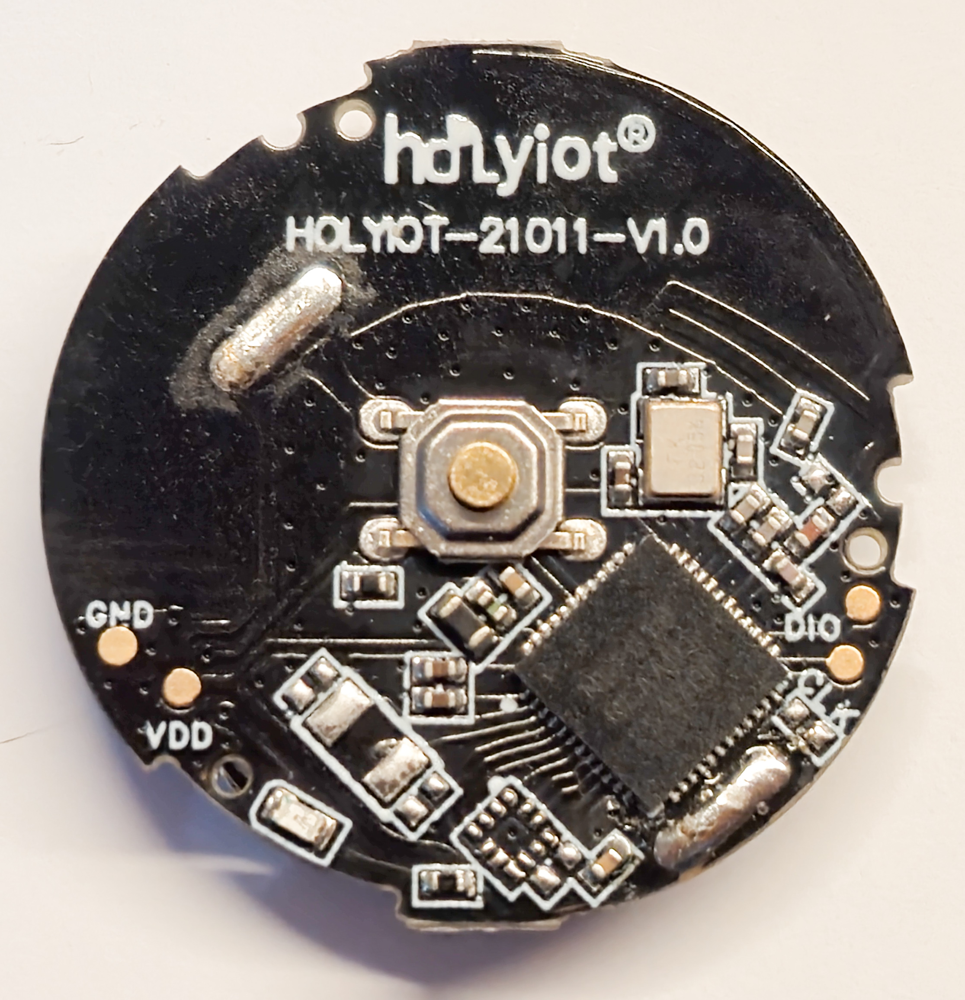

# HA Button

Battery-powered Bluetooth button firmware for the **HOLYIOT 21014 v1.0 and 21011 v1.0** (nRF52810), built with Zephyr and designed for Home Assistant through [BTHome](https://bthome.io/).

## Features

- Short press, double-click, hold detection, and release after a hold.
- Battery voltage reported with every event and at startup.
- A heartbeat after 6 hours without another report.
- Low-power GPIO sensing, short LED indications, and radio/ADC shutdown between reports.
- Build and flash tasks for VS Code.

## Hardware and wiring

You need a HOLYIOT 21014 or 21011 board, a CR2032 battery, and an SWD programmer. ST-Link V2 with OpenOCD has been tested.

| Programmer | HOLYIOT |
| --- | --- |
| Verified 3.3 V supply output | VDD |
| GND | GND |
| SWDIO | DIO |
| SWCLK | CLK |

Remove the battery when powering the board from the programmer. Never connect 5 V to VDD. A programmer's voltage-reference input is not a power output.

On the 21014, the onboard button uses P0.31 (active HIGH). The red, green, and blue LEDs use P0.29, P0.30, and P0.28 (active LOW). See [Zephyr's HOLYIOT board documentation](https://docs.zephyrproject.org/latest/boards/holyiot/holyiot_21014/doc/index.html).

### HOLYIOT 21011 v1.0 compatibility

The HOLYIOT 21011 v1.0 has been tested on hardware: button events in Home Assistant and onboard LED operation are confirmed. Its nRF52810 button uses P0.31 (physical pin 43, active HIGH); the LED uses P0.30 (physical pin 42, active LOW). Select `LED_COLOR_GREEN` (the default). This name refers to the 21014 RGB channel mapping, not the physical color of the 21011 LED.

The status LED uses an 8 ms pulse to reduce consumption. Battery accuracy and current consumption on the 21011 have not been measured.



## Home Assistant

1. Set up a supported Bluetooth receiver or proxy within range. Reception through Shelly has been tested.
2. Power on the button or press it to advertise.
3. In **Settings → Devices & services**, add the discovered BTHome device **HA Button21014**.
4. Create automations using the events below. Voltage is reported as a sensor in volts.

No operating-system Bluetooth pairing is required. An existing device may retain its previous or custom name in Home Assistant.

| Action | Event |
| --- | --- |
| Short press | `press`, 350 ms after release if no second press starts |
| Double-click | `double_press` after the second release; the second press must start within 350 ms of the first release |
| Hold for at least 800 ms | `hold_press`, once while held |
| Release after a hold | `long_press`, once on release |

**Use `hold_press` to start a hold action and `long_press` to stop it.** BTHome has no separate release code; this firmware uses these two events for the start and end of a hold.

Double-clicks and holds do not also generate a short press. A short click followed by holding the second press is treated as a hold and release. A triple-click is treated as a double-click followed by a short press.

## Battery reporting and power

The internal ADC measures VDD without an external resistor divider. When powered by the programmer, this is the supply voltage rather than the battery voltage. Readings have 1 mV resolution, not guaranteed 1 mV accuracy; battery percentage is not estimated.

Every button event includes a fresh reading and restarts the 6-hour heartbeat interval. Heartbeats report voltage without a button event or LED flash. A gesture in progress takes priority. If measurement fails, the button continues working and omits the invalid voltage.

The firmware uses tickless System ON sleep with an RTC, GPIO PORT/SENSE, and an 8 ms event LED flash. Event advertisements last 750 ms; heartbeats last 1.2 s. The radio and ADC turn off between reports. Each queued event gets at least 350 ms of advertising time, which can briefly delay a closely following release event.

Battery life and current consumption have not yet been measured. BLE advertising is unencrypted and does not acknowledge delivery. If reception is weak, increase the event advertising duration to 1200 ms. DC/DC remains disabled pending verification of the required board components.

## Configuration

| File | Settings |
| --- | --- |
| [src/app_config.h](src/app_config.h) | LED color, heartbeat interval, advertising duration, debounce, and LED timing |
| [src/button_gestures.h](src/button_gestures.h) | Double-click window and hold threshold |
| [prj.conf](prj.conf) | Bluetooth name, transmit power, and Zephyr options |

Choose the LED in `src/app_config.h` and rebuild:

```c
#define LED_COLOR LED_COLOR_GREEN
```

Use `LED_COLOR_RED` (P0.29), `LED_COLOR_GREEN` (P0.30, default), or `LED_COLOR_BLUE` (P0.28). The 21011 single-LED board uses `LED_COLOR_GREEN`. Only the selected GPIO is driven; the same LED signals startup, button events, and errors.

At startup, the selected LED flashes and the device advertises for 10 seconds. An 8 ms flash indicates a transmitted button event. A 20 ms flash every 5 seconds indicates an initialization or Bluetooth error. Heartbeats do not flash the LED.

## Building and flashing

Dependencies: **Zephyr 4.2.0**, **Zephyr SDK 0.17.4** with the ARM toolchain, Python 3.11, west, CMake, Ninja, and OpenOCD for flashing. The required Zephyr modules are `cmsis`, `cmsis_6`, and `hal_nordic`, at the revisions specified by the Zephyr manifest.

The project builds with Zephyr and west. The included Windows helper scripts expect a prepared tool environment under `%USERPROFILE%\.cache\ha-button`; they do not install dependencies. Before using the flash task, set `$openocdDir` in [tools/flash.ps1](tools/flash.ps1) to your OpenOCD installation directory, containing `bin/openocd.exe` and `share/openocd/scripts`.

Open this folder in VS Code and use **Ctrl+Shift+B** to build, or run:

```powershell
.\tools\build.ps1
.\tools\flash.ps1
```

Build output is copied to `firmware/`. The build script uses a directory junction to avoid spaces in build paths. The **Build and flash BTHome button** task runs both steps.

Flashing verifies the image by readback before starting it; it does not mass-erase the device, modify UICR, or enable readout protection.

## Tests

Run the **Test button gestures** VS Code task to test the production gesture logic and BTHome packet encoding in a Cortex-M4 emulator. The test runner requires the ARM toolchain and the Python packages `pyelftools` and `unicorn`.

## Changelog

### 2026-09-17 - HOLYIOT 21011 hardware verification

- Confirmed Home Assistant button events and LED operation on HOLYIOT 21011 v1.0.
- Corrected its LED mapping to P0.30 (physical pin 42), active LOW; made `LED_COLOR_GREEN` the default.
- Restored the 8 ms LED pulse after the 500 ms diagnostic test.

### 2026-09-17 - Selectable LED and HOLYIOT 21011

- Added a selectable status LED color.
- Documented HOLYIOT 21011 v1.0 compatibility and included a board photograph.
- Unselected LED GPIOs are left unconfigured.

### 2026-09-17 — Battery reporting and power savings

- Added voltage measurements at startup, on every button event, and on idle heartbeats.
- Added a 6-hour heartbeat without generating a button event.
- Switched button detection to GPIO PORT/SENSE.
- Reduced LED time from 60 ms to 8 ms, event advertising from 1200 ms to 750 ms, and startup advertising from 30 s to 10 s.
- Added packet encoding tests and graceful handling of ADC errors.

### 2026-09-17 — Button gestures

- Added double-click, hold, and release-after-hold events.
- Added an event queue to preserve closely spaced events.
- Added automated gesture tests.

### 2026-09-17 — Initial implementation

- Added short-press BTHome events, debouncing, and LED feedback.
- Added the board definition, VS Code tasks, and ST-Link flashing with readback verification.

## References

- [BTHome data format](https://bthome.io/format/)
- [Home Assistant BTHome integration](https://www.home-assistant.io/integrations/bthome/)
